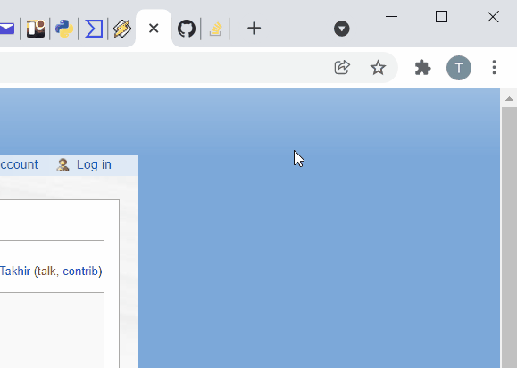
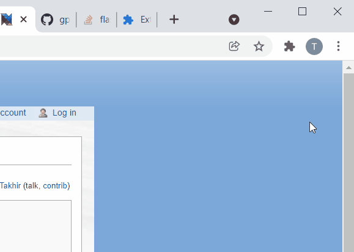

# GPSIO Extension

GPSIO is a web browser extension (and supporting 'native host') that aids the transfer of GPS data between web pages (primarily CalTopo and SARTopo) and Garmin GPS devices.

GPSIO is a replacement for the Garmin Communicator plugin, built on open web standards.  It was created around the time that web browsers stopped supporting NPAPI Plugins such as Garmin Communicator (2016-2017), with a transfer of ownership in 2020/2021 and new browser extensions (with new extension IDs) starting in November 2021.

Supported browsers are Chrome, Firefox, and Edge. Supported OSs are Mac, Windows and (soon) Linux, though currently there is only a Windows installer.  The Mac installer is in progress; until it is available, you will need to follow the 'Manual Installation' procedure below.

## Using GPSIO
The only part of GPSIO that the user normally sees is the transfer method selection after clicking Export or Import in CalTopo / SARTopo / CalTopo-Desktop.  The user can also click the extension icon, at the top right of the web browser, to show and modify the GPSIO data filter settings.  See below for more details.

# Installing GPSIO
A Windows installer (using Nullsoft Scriptable Install System) is in final testing.  Until it is published, please follow the manual installation process:

## Manual installation

### 1. Install the GPSIO web browser extension
The GPSIO browser extension is published for Chrome, Firefox, and Edge.  This is a new extension as of November 2021; the new extension has a different icon than previous versions.  The extension from before November 2021 will not work with the host from November 2021.
- Chrome: [gpsio at the Chrome Web Store](https://chrome.google.com/webstore/detail/gpsio/cbpembjdolhcjepjgdkcflipfojbjall)
- Firefox: [gpsio at AMO (addons.mozilla.org)](https://addons.mozilla.org/en-US/firefox/addon/gpsio-extension/)
- Edge: [gpsio at Edge AddOns](https://microsoftedge.microsoft.com/addons/detail/gpsio/gnonahdiojppiacfbalpgjddpkfepihk)

### 2. Install GPSBabel
GPSBabel is a free open-source program for working with GPSs and GPS data (consider making a donation). Click [here](http://www.gpsbabel.org/download.html) to download.  The native host makes calls to GPSBabel.

### 3. For Windows: Install Garmin USB drivers
The latest Garmin USB drivers are available [here](https://www8.garmin.com/support/download_details.jsp?id=591). For USB-mode devices (Garmin 60 or similar non-mass-storage-mode devices), you can run Windows Device Manager to verify the driver installation: if the drivers are installed properly, a plugged-in Garmin USB-mode device will show up in a category named "Garmin Devices"; if the drivers are not installed, a plugged-in Garmin USB-mode device will show up as "Unknown USB Device", causing CalTopo GPSIO transfers to abort with a red line of text indicating that no GPS was found. (Mass-storage-mode devices such as Garmin 62, 64, etc. will instead show up under 'Drives' and/or 'Portable Devices'.)

### 4. Install the native host application
(In previous versions, Python had to be installed on your computer.  Starting in November 2021, Python installation is no longer needed, since the compact embeddable Python core is part of the GPSIO installation.)

In Windows, the host is a batch file (gpsio-host.bat) that invokes a python script (gpsio-host.py, formerly wrapper.py).  You can find those files in the host directory above.

You will also need to tell the browser extensions where the actual native host files are located on your computer.  The GPSIO installer will take care of this for you.  If you need to do this step by hand, the methods for doing this are documented in the various browser development documents, and are different for Windows vs. Mac.  While the installers are under construction, please contact the developer if you need help setting this up.

## Extensions - Enable and Pin
While the installer attempts to add the extensions to your web browsers, you may still need to enable the extensions.  Sometimes you will be prompted to do so, and sometimes you will not.  This can't be done automatically by the installer, for security reasons.  Here's what enabling the extension looks like in Chrome, if it's not already enabled:

Also in Chrome, even after the extension is enabled, its icon doesn't appear by default.  You will probably want to 'pin' the extension so that its icon always appears:

### Extension permissions
When the GPSIO extension is about to be added to your web browser, you will be told that it needs two types of permission that may sound daunting.  Why are these permissions needed?
1. Read and change all your data on all websites - Originally, the extension was limited to only be usable on sartopo.com and caltopo.com.  With the advent of CalTopo Desktop, the host machine name - therefore the web page domain name - could be anything (localhost, myMapServer, 192.168.200.200, etc.).  While the permission sounds scary, the extension only transfers GPS data - but it can be used on any web page.
2. Communicate with cooperating native applications - This Native Messaging is explained above in 'GPSIO Architecture'.  The extension only communicates with the official GPSIO host application.

# Details
## GPSIO Architecture
GPSIO requires multiple parts to all be working together.  See the installation details below.
1. Extension - The GPSIO browser extension allows the web page to commuicate with the host. 
2. Host - Browser extensions are not capable of talking to hardware devices.  The host is a separate program, running on the same computer as the web browser, that talks with GPS devices.  The extension uses 'Native Messaging' to talk with the host.  You can read about Native Messaging online.  The host is written in Python, but no separate Python installation is needed, since the official 'embeddable' Python package is a part of the GPSIO installation.
3. GPSBabel - The host, in turn, may call GPSBabel to talk with the GPS device, and to organize imported data.
4. Garmin USB Drivers - For older devices, the Garmin USB Drivers are necessary to allow the GPS device to work with the computer.

## Garmin GPS Data Transfer Methods
1. GMSM - Most of the modern Garmin handlheld GPS devices use Garmin Mass Storage Mode (GMSM) to transfer data: the device will automatically show up as another drive (actually, two drives if the device has a memory card) after you plug it in - as if you plugged in a thumb drive or other external drive.  For these devices, GPSIO is just a wrapper around the normal file selection and transfer actions, though GPSIO does provide the additional filters that you see in the options popup, and it will automatically import multiple files as appropriate.  So, GPSIO can potentially provide a more streamlined, consistent, and trainable import and export experience, saving a couple of clicks each time, and avoiding the need to navigate to or sort through files during import.  In the hands of an experienced savvy operator, this may not be of much benefit.

2. Garmin Serial Protocol - This is only used by very old Garmin devices such as the GPSMap 60 series.  These devices do not mount as a drive, so you need a tool like GPSIO or Garmin Basecamp or GPSBabel to exchange data with these devices.  In this case, GPSIO is actually a wrapper around a call to GPSBabel, which is automatically installed by the GPSIO installer.

3. MTP - Some newer Garmin devices (Alpha 200i) use Media Transfer Protocol (MTP).  This is the same protocol used by most smartphones to transfer files, especially images and music.  Windows will mount your MTP device as another entry in the file browser, but without a drive letter.  MTP is not yet supported in GPSIO.  So, you will have to export to file and import from file.  Adding MTP support to GPSIO is high on the priority list but there is no expected ETA.  Take a look [here](https://github.com/ncssar/gpsio/issues/12) and please contribute if you can.  (Also check [here](https://github.com/ncssar/gpsio/issues/10#issuecomment-817205961) regarding the Alpha 200i MTP vs GMSM.)

# Usage
Importing to and Exporting from CalTopo/SARTopo using GPSIO is basically the same as Importing and Exporting with any file type.  Just make sure to select GPSIO, rather than a file type, after selecting Import or Export.

## Importing GPS Tracks and Waypoints as Lines and Markers using GPSIO
1. Connect the GPS to the computer with a USB cable. It may take the GPS a minute or two to save the tracks and establish a connection.
  - wait for the computer to indicate that it recognizes the device; if you proceed to the next step too soon, you will get a red error, in which case you can just try again after the device is recognized.
2. On the CalTopo top menu bar, click "Import" and "Connect via GPSIO".
3. A message will appear while the GPS is being read.
4. If the connection is unsuccessful, you may see an error message. The extension may not be correctly installed, or you may have not given the GPS long enough to connect.
5. A second message will appear once the data has been read and is being processed.
6. Un-check any waypoints or tracks you do not want to import and click "Import".
7. Track will appear in the "Lines & Polygons" folder, waypoints will appear in the "Markers" folder.

## Exporting Lines, Polygons and Markers to GPS Units using GPSIO
1. Connect the GPS to the computer with a USB cable. It may take the GPS a minute or two to save the tracks and establish a connection.
2. On the CalTopo top menu bar, click "Export" and "Connect via GPSIO".
3. Un-check any objects you do not want to import and click "Export".
4. Once the export is complete, you will see this message:
5. If the connection is unsuccessful, you may see an error message. The extension may not be correctly installed, or you may have not given the GPS long enough to connect.

## Contributing
GPSIO is free software (GPL) and is hosted at https://github.com/ncssar/gpsio. Contributions are welcome; two high priority items are Linux installation support and integration with non-Garmin GPSs (either through auto-detection or a user-selectable GPS type dropdown). Testing with additional GPS units is also valuable; send bug reports to the developer.

## Troubleshooting / debugging
You tried to install GPSIO but it's not working... what now?  Troubleshooting GPSIO is tricky because it has multiple parts.  Here are some troubleshooting guidelines:
1. Do you see the GPSIO extension icon (a very small globe with two red arrows) at the top right of your browser window, alongside any other extension icons?
    - YES: go to the next step
    - NO: the browser extension hasn't been installed; see the installation steps above.  If that doesn't solve it, contact the developer with these details.
2. Left-click the GPSIO extension icon.  A small popup box should appear near the extension icon.  Does it have a red line of text that says 'Cannot communicate with host', or, a green line of text that says 'Plugin working properly' with a selection of filter options?
    - RED: left-click 'check again' once or twice.  If the red line doesn't go away, go to the next step.
    - GREEN: contact the developer with exact details of the error you're seeing.
3. Open a command terminal, go to the default gpsio installation directory (normally, the 'gpsio' directory under your user home directory), and run gpsio-host.py using python.  Any error messages in the first part of gpsio-host.py will show up here, but most of the code relies on being run through the browser so won't be tested by running it from the command line.
4. If you see 'Reading data from GPS . . .' followed by a bold red line 'GPS Exception: Unexpected disconnect' when you try to import using GPSIO, check the GPSIO log file (normally gpsio-host_log.txt in your home directory).  This indicates that gpsio-host.py encountered an error, which will hopefully show up in the log file.

Always feel free to contact the developer if you have any questions.
