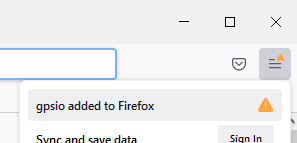

# GPSIO Extension

GPSIO is a web browser extension (and supporting 'native host') that aids the transfer of GPS data between web pages and GPS devices.

While GPSIO is originally intended for use with [CalTopo.com](https://caltopo.com), [SARTopo.com](https://sartopo.com), and CalTopo Desktop (the locally hosted version of CalTopo and SARTopo), it could be applied to other web pages.

| Installer              | Download          |
| :--------------------- | :---------------- |
| Windows Installer      | [install-gpsio.exe](https://github.com/ncssar/gpsio/raw/master/installer/install-gpsio.exe) |
| MacOS Installer        | [gpsio.pkg](https://github.com/ncssar/gpsio/raw/master/installer/gpsio.pkg) |
| Linux Installer        | Testers needed    |

> **INSTALLER SECURITY NOTES:** Like many installers, this installer will probably be blocked or flagged as "from an unidentified developer".  On Mac, you will need to locate the downloaded file in Finder, then hold down Control (not Command) when you click gpsio.pkg, select 'Open' from the file's menu, and answer 'Open' when prompted with the security warning - this will add it as a security exception [(see Apple's docs here)](https://support.apple.com/guide/mac-help/open-a-mac-app-from-an-unidentified-developer-mh40616/mac), and you can delete it after installation is complete.  On Windows, you will need to follow the prompts to 'Run Anyway'.

> In addition, Mac and Windows installers may both ask for your password so the installer can be run with the necessary permissions, since it edits registry settings, Applications folders, etc.

GPSIO is a replacement for the Garmin Communicator plugin, built on open web standards.  It was created around the time that web browsers stopped supporting NPAPI Plugins such as Garmin Communicator (2016-2017), with a transfer of ownership in 2020/2021 and new browser extensions (with new extension IDs) starting in November 2021.

Currently, only Garmin handheld devices are supported, but that could change in the future.

Supported browsers are Chrome, Firefox, and Edge. Supported OSs are MacOS, Windows, and (soon) Linux.

## Updating the Host
Did the extension tell you that a new version of the host is available?  Updating the host on Windows involves copying the [latest version of gpsio-host.py](https://github.com/ncssar/gpsio/tree/master/host/common) to your computer's GPSIO host directory, typically C:\Program Files (x86)\GPSIO.  On Mac, you will need to download and run the installer again, or, replace the entire GPSIO host directory on your computer (typically /Library/GPSIO) with [the latest from this repository](https://github.com/ncssar/gpsio/tree/master/host/mac/dist/gpsio-host).  At some point, a host-only updater program will be available.

## Using GPSIO
The only part of GPSIO that the user normally sees is the transfer method selection after clicking Export or Import in CalTopo / SARTopo / CalTopo-Desktop.  The user can also click the extension icon, at the top right of the web browser, to show and modify the GPSIO data filter settings.  See below for more details.

# Installing GPSIO
Installers for Windows and MacOS are available above.  These installers are meant to encompass all of the manual installation steps listed below.  For linux, or if the installers don't work for whatever reason, you can follow this manual installation procedure.

## MacOS installation notes

For MacOS, you may see this during installation if you have an external drive plugged in:

You can safely answer "Don't Allow".  The installer does not actually need access to the external drive.

(Later, you may be asked for access to external drives the first time you actually use GPSIO - you DO need to allow that access, since modern Garmin GPSes are actually external drives; see 'GMSM' below.)

The installer will tell you that over 90MB of space is required.  That's only true if you don't already have GPSBabel installed.  If you already have GPSBabel installed, the installation size is around 12MB.

## Manual installation

### 1. Install the GPSIO web browser extension
The GPSIO browser extension is published for Chrome, Firefox, and Edge.  This is a new extension as of November 2021; the new extension has a different icon than previous versions.  The extension from before November 2021 will not work with the host from November 2021.
- Chrome: [gpsio at the Chrome Web Store](https://chrome.google.com/webstore/detail/gpsio/cbpembjdolhcjepjgdkcflipfojbjall)
- Firefox: [gpsio at AMO (addons.mozilla.org)](https://addons.mozilla.org/en-US/firefox/addon/gpsio-extension/)
- Edge: [gpsio at Edge AddOns](https://microsoftedge.microsoft.com/addons/detail/gpsio/gnonahdiojppiacfbalpgjddpkfepihk)

### 2. Install GPSBabel
GPSBabel is a free open-source program for working with GPSs and GPS data (consider making a donation). Click [here](http://www.gpsbabel.org/download.html) to download.  The native host makes calls to GPSBabel in the background.

### 3. For Windows: Install Garmin USB drivers
The latest Garmin USB drivers are available [here](https://www8.garmin.com/support/download_details.jsp?id=591). For USB-mode devices (Garmin 60 or similar non-mass-storage-mode devices), you can run Windows Device Manager to verify the driver installation: if the drivers are installed properly, a plugged-in Garmin USB-mode device will show up in a category named "Garmin Devices"; if the drivers are not installed, a plugged-in Garmin USB-mode device will show up as "Unknown USB Device", causing CalTopo GPSIO transfers to abort with a red line of text indicating that no GPS was found. (Mass-storage-mode devices such as Garmin 62, 64, etc. will instead show up under 'Drives' and/or 'Portable Devices'.)

### 4. Install the native host application
The host uses Python 3.  A minimal installation of Python 3 is included in the Windows and Mac installers, so you do not need to install Python separately.  (Previous Windows versions of the GPSIO host did require you to install Python separately.)

In Windows, the host is a batch file (gpsio-host.bat) that invokes a Python script (gpsio-host.py, formerly wrapper.py).  You can find those files in the host directory above.

The browser extensions need to know where the actual native host executable is located on your computer.  This mapping is done by the 'Native Messaging Host Manifest' files.  The GPSIO installer will create these files for you.  If you need to do create the manifests by hand, refer to the various browser development documents.  Please contact the developer if you need help setting this up.

## Extensions - Installation Follow-up and Details

***IF YOU HAVE THE OLD EXTENSION, REMOVE IT:*** &nbsp;&nbsp;&nbsp;&nbsp;&nbsp;&nbsp;***MAKE SURE YOU SEE THE NEW EXTENSION:*** 

If you have the old version of the GPSIO extension installed, you will want to remove it from your browser.  You can do this from the menu that appears when you right-click the old extension icon.

Due to browser security restrictions, the installer only ***attempts*** to add the latest GPSIO extension to your web browser(s).  Even if the attempts work, there are a few reasons you may not see the new extension icon right away.  After reading these notes, if you determine that the extension was not added by the installer, see [the links above](https://github.com/ncssar/gpsio/blob/master/README.md#1-install-the-gpsio-web-browser-extension) to add the extension to your browser directly.

On Mac and Linux, you may not even see an entry for gpsio in the Manage Extensions page, until you restart your web browser.

If the extension is added successfully by the installer, ***you may still need to enable it.***  You only need to enable it once (for each browser that you use), but you might or might not be prompted to do so.  Enabling the extension cannot be done automatically by the installer, for security reasons.  As an example, here's what enabling the extension looks like in Chrome:

Also in Chrome, even after the extension is enabled, its icon doesn't appear by default.  You will probably want to 'pin' the extension so that its icon always appears:

In Firefox, you may not be notified about the installed extension until you restart Firefox, when it may appear as a yellow warning triangle at the top right:

Click 'gpsio added to Firefox' which should prompt you to enable the extension.

### Extension permissions
When the GPSIO extension is about to be added to your web browser, you will be told that it needs two types of permission that may sound daunting.  Why are these permissions needed?
1. Read and change all your data on all websites - Originally, the extension was limited to only be usable on sartopo.com and caltopo.com.  With the advent of CalTopo Desktop (formerly SARTopo Offline, formerly SARSoft), the host machine name - therefore the web page domain name - could be anything (localhost, myMapServer, 192.168.200.200, etc.).  While this permission sounds scary, the extension only transfers GPS data - but it can be used on any web page.
2. Communicate with cooperating native applications - This Native Messaging is explained below in 'GPSIO Architecture'.  The extension only communicates with the official GPSIO host application.

# Details
## GPSIO Architecture
GPSIO requires multiple parts to all be working together.  See the installation details below.
1. Extension - The GPSIO browser extension allows the web page to commuicate with the host. 
2. Host - Browser extensions are not capable of talking to hardware devices.  The host is a separate program, running on the same computer as the web browser, that talks with GPS devices.  The extension uses 'Native Messaging' to talk with the host.  You can read about Native Messaging online.  The host is written in Python, but no separate Python installation is needed, since the official 'embeddable' Python package is a part of the GPSIO installation.
3. GPSBabel - The host, in turn, may call GPSBabel to talk with the GPS device, and to organize imported data.
4. Garmin USB Drivers - For older devices, the Garmin USB Drivers are necessary to allow the GPS device to work with the computer.

## Garmin GPS Data Transfer Methods
1. GMSM - Most of the modern Garmin handlheld GPS devices use Garmin Mass Storage Mode (GMSM) to transfer data: the device will automatically show up as another drive (actually, two drives if the device has a memory card) after you plug it in - as if you plugged in a thumb drive or other external drive.  For these devices, GPSIO is just a wrapper around the normal file selection and transfer actions, though GPSIO does provide the additional filters that you see in the options popup, and it will automatically import multiple files as appropriate.  So, GPSIO can potentially provide a more streamlined, consistent, and trainable import and export experience, saving a couple of clicks each time, and avoiding the need to navigate to or sort through files during import.  In the hands of an experienced savvy operator, this may not be of much benefit.

2. Garmin Serial Protocol - This is only used by very old Garmin devices such as the GPSMap 60 series.  These devices do not mount as a drive, so you need a tool like GPSIO or Garmin Basecamp or GPSBabel to exchange data with these devices.  In this case, GPSIO is actually a wrapper around a call to GPSBabel, which is automatically installed by the GPSIO installer.

3. MTP - Some newer Garmin devices (Alpha 200i) use Media Transfer Protocol (MTP).  This is the same protocol used by most smartphones to transfer files, especially images and music.  Windows will mount your MTP device as another entry in the file browser, but without a drive letter.  MTP is not yet supported in GPSIO.  So, you will have to export to file and import from file.  Adding MTP support to GPSIO is high on the priority list but there is no expected ETA.  Take a look [here](https://github.com/ncssar/gpsio/issues/12) and please contribute if you can.  (Also check [here](https://github.com/ncssar/gpsio/issues/10#issuecomment-817205961) regarding the Alpha 200i MTP vs GMSM.)

# Usage
Whether importing or exporting, start by connecting the GPS to the computer with a USB cable.

For GMSM models (Garmin 62 and newer), the device is not ready until the computer recognizes and mounts it as an external drive.  On Windows, the computer will play a sound when the GPS is mounted and ready for transfer.  If you proceed to the next step too soon, you will get a red error message, in which case you can just leave the GPS plugged in, and try to import or export again after the GPS is recognized.  Note: this delay also happens even if you do not use GPSIO - it's the case whenever you plug a GMSM model into the computer.

It may take the GPS a while to save its tracks and other data, before it can establish a connection to the computer.  The more data on the GPS, the longer this part will take - a good reason to encourage GPS users to keep a clean GPS.  You can often speed up this 'boot' process by turning on the GPS a few minutes before plugging it in.

Garmin Serial Protocol models don't need to mount as a drive, so they are ready for transfer immediately.

After the GPS is ready for transfer, Importing to and Exporting from CalTopo/SARTopo using GPSIO is basically the same as Importing and Exporting with any file type.  Just make sure to select GPSIO, rather than a file type, after selecting Import or Export.

Once the transfer is complete, you can unplug the GPS from the computer.  Technically, as with any external drive, you 'should' dismount or 'eject' it from Windows before actually unplugging it, but we have never noticed any issues that could be traced back to failure-to-eject-before-unplug, after thousands of GPSIO transfers during search operations.

## Contributing
GPSIO is free software (GPL) and is hosted at https://github.com/ncssar/gpsio. Contributions are welcome; two high priority items are Linux installation support and integration with non-Garmin GPSs (either through auto-detection or a user-selectable GPS type dropdown). Testing with additional GPS units is also valuable; send bug reports to the developer.

## Troubleshooting / debugging
You tried to install GPSIO but it's not working... what now?  Troubleshooting GPSIO is tricky because it has multiple parts.  Here are some troubleshooting guidelines:
1. Do you see the GPSIO extension icon (a very small globe with two red arrows) at the top right of your browser window, alongside any other extension icons?
    - YES: go to the next step
    - NO: the browser extension hasn't been installed and/or enabled (and/or 'pinned' for Chrome); see the installation steps above.  If that doesn't solve it, contact the developer with these details.
2. Left-click the GPSIO extension icon.  A small popup box should appear near the extension icon.  Does it have a red line of text that says 'Cannot communicate with host', or, a green line of text that says 'Plugin working properly', or a blue line that says 'OK for now', with a selection of filter options?
    - RED: left-click 'check again' once or twice.  If the red line doesn't go away, go to the next step.
    - GREEN: contact the developer with exact details of the error you're seeing.
    - BLUE: follow the steps for GREEN; also, tell your local tech support that it's time to update the GPSIO host.
3. Open a command terminal, go to the default gpsio installation directory (normally, C:\Program Files (x86)\GPSIO on Windows, or /Library/GPSIO on mac), and run gpsio-host.py using python.  It should appear to hang - just type a few letters and hit enter.  Any error messages in the first part of gpsio-host.py will show up here, but most of the code relies on being run through the browser so won't be tested by running it from the command line.
4. If you see 'Reading data from GPS . . .' followed by a bold red line 'GPS Exception: Unexpected disconnect' when you try to import using GPSIO, check the GPSIO log file (normally gpsio-host_log.txt in your home directory).  This indicates that gpsio-host.py encountered an error, which will hopefully show up in the log file.

Always feel free to contact the developer if you have any questions.

## F.A.Q

### Q: GPSIO has a LOT of moving parts and seems awfully complicated under the hood.  Is it worth it?
A: If you are quick and comfortable with navigating the file browser, including a quick visual scan of file sizes and modification times, and all of the GPSes that you will be using mount up as external drives like GMSM (above), then GPSIO may not be of much or any benefit to you.  Also, the advent of smartphone navigation apps (like the CalTopo app) -- which limit the need for handheld GPS devices, and may eventually eliminate that need entirely -- is certainly changing the landscape of things.  We won't be offended if you don't use GPSIO!  The intended benefits are:
- simplicity, trainability, and usability by a broader target audience: there's no need to interact with the file browser
- speed: reduction of just a few mouse clicks, repeated over large numbers of GPSes, can be a big time saver
- filtering: import and export filtering options, in the extension icon popup, aren't available when transfering files directly
- behind-the-scenes features: files that would not normally be readable by SARTopo or CalTopo due to missing GPX extensions are automatically edited during import to be compatible [(see details here)](https://github.com/ncssar/gpsio/issues/1)

### Q: Does the extension use MV3 (Manifest Version 3)?
A: Chrome has announced its timeline for end-of-life for MV2.  MV3 reportedly offers security and performance benefits.  The Chrome and Edge extensions are MV3 (beginning with version 1.0 in November 2021).  Firefox does not support MV3 at the time of writing.  If Firefox does support MV3 in the future, the GPSIO Firefox extension will be redone to match.

### Q: Do I need to be connected to the internet when I run the installer?
A: Strictly speaking, no you do not.  But, life will be easier if you are.  The installer inserts flags that indicate the extension should be added to the browsers.  Those flags can be set without internet, in which case the extension should automatically be added the next time you start the browser while connected to the internet.  The other components do not need an internet connection, and once the extensions are installed, you can use them offline from any web page.

### Q: Why is the installer file so big (>70MB)?
A: The unmodified prerequisites (GPSBabel installer, the Firefox extension archive, and the Garmin USB Drivers installer for Windows) are included in the installer.  This way, the prerequesistes can be installed without internet connection if needed, and the exact version numbers of the prerequisite tools are controlled.

### Q: Why does the mac installer ask for permission to access files on removable drives?
A: No idea.  Nothing in the installer requires access to removable drives.  [This question has been raised on Stackoverflow.](https://stackoverflow.com/questions/70173334)
